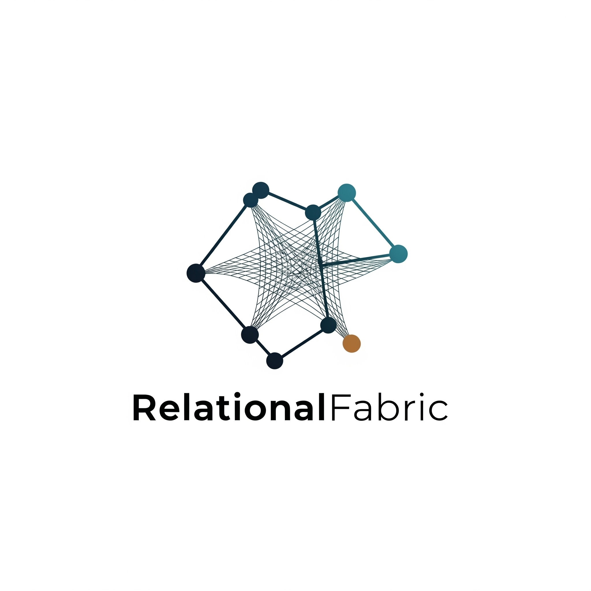

Welcome to **RelationalFabric**, where we believe the true power of data lies in its relationships, its interconnectedness, and its ability to be composed into something greater.

In today's digital landscape, groundbreaking advancements in database technology, distributed systems, and theoretical research often remain siloed, hidden away in complex implementations or academic papers. The building blocks that could revolutionize how we interact with and manage information are frequently out of reach, hindering innovation and fostering unnecessary complexity.

At RelationalFabric, we're on a mission to change that. We're dedicated to **unlocking** these invaluable, often missing, composable pieces. Our focus is squarely on exploring the frontiers of data technology, with a particular emphasis on the **graph-centric nature** of information—understanding how entities connect and relate, rather than just isolated data points.

Our exploration spans several critical domains:

* **FAIR Data Principles**: We're investigating how to build systems that inherently make data **Findable, Accessible, Interoperable, and Reusable**. Our work aims to break down data silos and enable true data liquidity across diverse environments.
* **Developer Experience (DX)**: We believe powerful tools should also be a joy to use. Our efforts prioritize creating intuitive, ergonomic libraries and frameworks that drastically improve how developers interact with complex data systems, reducing friction and accelerating innovation.
* **Distributed Graphs**: Moving beyond centralized systems, we're tackling the challenges and opportunities of managing and querying massive, interconnected datasets across distributed networks. This involves pioneering new approaches to consistency, resilience, and performance at scale.
* **Pattern Matching & Distributed Query**: Unlocking insights from vast, distributed graphs requires sophisticated query capabilities. We're developing advanced techniques for **pattern matching** and **distributed query execution**, allowing users to intuitively discover complex relationships and extract valuable knowledge from their data, no matter where it resides.
* **Data Sovereignty**: In an era where data ownership and control are paramount, we're exploring technical solutions that empower individuals and organizations with true **data sovereignty**. Our work contributes to architectures where control remains with the data owner, fostering trust and privacy in distributed environments.

We provide practical, high-quality libraries, frameworks, and resources designed to empower developers and organizations to:

* **Connect** disparate data sources and systems with ease.
* **Compose** intricate data workflows and applications from reusable modules.
* **Conquer Complexity** by transforming monolithic structures into flexible, adaptable, and performant systems.

Join us as we weave together the future of data, making sophisticated concepts accessible and enabling a more interconnected, intelligent world.
